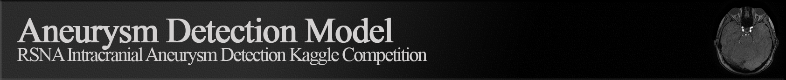
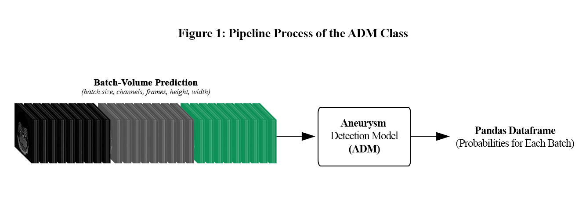
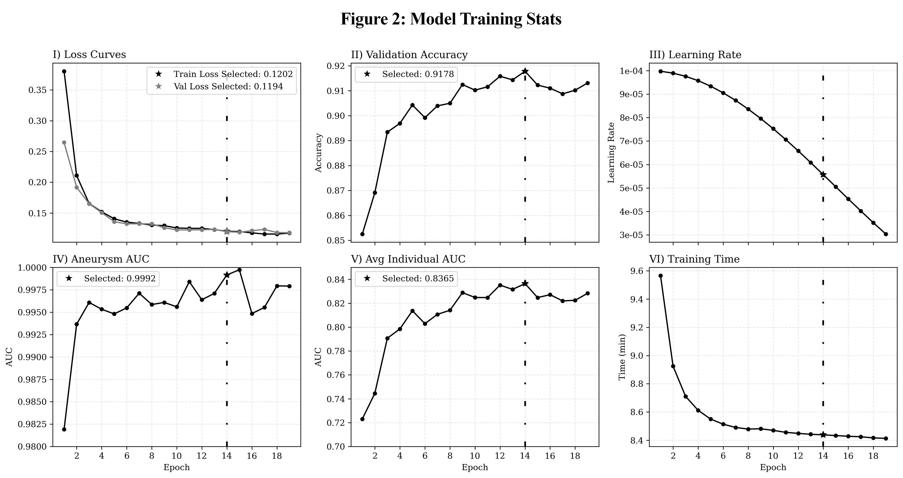

This code provides the implementation of the model proposed in the RSNA Intracranial Aneurysm Detection Competition (submitted on Oct. 14, 2025), including some utility methods.

## Features


- **Automatic model download** from Hugging Face Hub.
- **Flexible inference:** Accepts both single and batched inputs, in NumPy or PyTorch tensor formats.
- **Preprocessing included:** Handles grayscale conversion and channel stacking internally.
- **Output as DataFrame:** Returns predictions as a pandas DataFrame with named columns for each anatomical region.

## How it works

The main class, `AneurysmDetection`, loads a pretrained 3D ResNet model and provides a unified method (`predict_tensor`) for inference. The method accepts:
- A single input with shape `(C, D, H, W)`
- A batch of inputs with shape `(B, C, D, H, W)`
- A list of inputs, each with shape `(C, D, H, W)`

The model expects volumetric data (e.g., MRI or CT) with:
- `C`: Number of channels (usually 1 for grayscale)
- `D`: Number of slices/frames (default: 16)
- `H`, `W`: Height and width (default: 224x224)

## ADM Model Info
### Training Stats



### Architecture (Aneurysm Detection Model)

| Component       | Description                                                                 |
|-----------------|-----------------------------------------------------------------------------|
| **Backbone**    | **VideoResNet (R3D-18)**                                                    |
| ├─ Stem         | Conv3d(3→64, kernel=3×7×7, stride=(1,2,2)) → BN3d → ReLU                   |
| ├─ Layer1       | 2 × BasicBlock(64→64)<br>Each: Conv3d(3×3×3, stride=1) → BN3d → ReLU       |
| ├─ Layer2       | 2 × BasicBlock(64→128)<br>• Block 1: stride=2 + downsample(64→128)<br>• Block 2: stride=1 |
| ├─ Layer3       | 2 × BasicBlock(128→256)<br>• Block 1: stride=2 + downsample(128→256)<br>• Block 2: stride=1 |
| ├─ Layer4       | 2 × BasicBlock(256→512)<br>• Block 1: stride=2 + downsample(256→512)<br>• Block 2: stride=1 |
| ├─ AvgPool      | AdaptiveAvgPool3d(output=1×1×1)                                            |
| └─ FC           | Identity (ResNet final FC removed)                                         |
| **Classifier**  | MLP:<br>Linear(512→512) → BN1d → ReLU → Dropout(0.3)<br>Linear(512→256) → BN1d → ReLU → Dropout(0.3)<br>Linear(256→14) |

### Training Information

| Model name         | Total parameters | Target label      | Best checkpoint    | Validation Score | Aneurysm AUC | Mean AUC | Optimizer  | Scheduler          | Learning rate | Weight decay | Accumulation | Early stopping | Class weight | Combined loss      | Cross-validation   |
|---------------------|------------------|-------------------|--------------------|------------------|--------------|----------|------------|---------------------|---------------|--------------|--------------|----------------|--------------|--------------------|--------------------|
| r3d_18_aneurysm     | 33,565,390       | Aneurysm Present  | Epoch 14/30 ⭐      | 0.91781          | 0.99916      | 0.83645  | AdamW      | CosineAnnealingLR  | 1e-4          | 1e-4         | 4            | 5              | 3.0          | Yes (focal=0.3)    | 10-fold (k=10)     |


##  Example usage
To get started, clone the repository using the command below:

```bash
!git clone https://github.com/NeoGreenCode/AneurysmDetection.git
```

```python
from AneurysmDetection import AneurysmDetection as A_model
import numpy as np

# Initialize the model (downloads weights automatically if not present)
a = A_model(model_name="R3D18_AneurysmDetection_33M")

# Create a dummy batch of 10 volumes, each with shape (C=1, D=16, H=224, W=224)
dummy_array = np.random.randn(2, 1, 16, 224, 224).astype(np.float32)

pred = a.predict_tensor(dummy_array)
pred
```
|   | Left Infraclinoid Internal Carotid Artery | Right Infraclinoid Internal Carotid Artery | Left Supraclinoid Internal Carotid Artery | Right Supraclinoid Internal Carotid Artery | Left Middle Cerebral Artery | Right Middle Cerebral Artery | Anterior Communicating Artery | Left Anterior Cerebral Artery | Right Anterior Cerebral Artery | Left Posterior Communicating Artery | Right Posterior Communicating Artery | Basilar Tip | Other Posterior Circulation | Aneurysm Present |
|---|-------------------------------------------|--------------------------------------------|-------------------------------------------|--------------------------------------------|-----------------------------|------------------------------|-------------------------------|-------------------------------|--------------------------------|-------------------------------------|--------------------------------------|-------------|-----------------------------|------------------|
| 0 | 0.052423                                 | 0.081153                                   | 0.247672                                  | 0.140270                                   | 0.137513                    | 0.159553                     | 0.133901                      | 0.046614                      | 0.042221                         | 0.024711                            | 0.041733                             | 0.040193    | 0.046926                    | 0.598635         |
| 1 | 0.052246                                 | 0.081089                                   | 0.251525                                  | 0.145575                                   | 0.136922                    | 0.160558                     | 0.136903                      | 0.045311                      | 0.042342                         | 0.024428                            | 0.042559                             | 0.040697    | 0.047657                    | 0.602177         |
